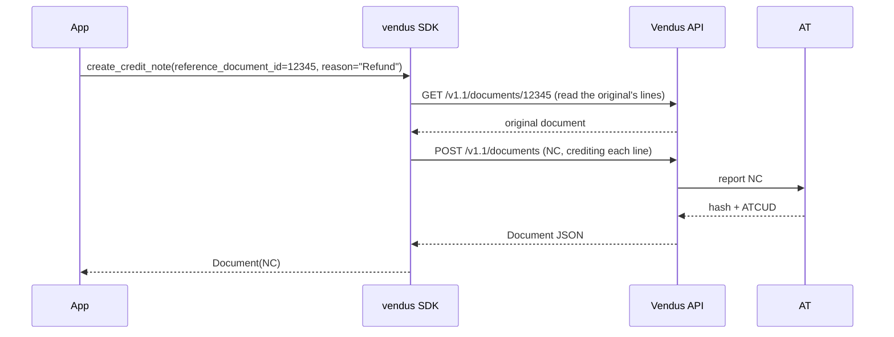

# Credit Note (NC)

## What it is

A Credit Note (NC) credits a previously issued invoice (FT or FR). It is the legal mechanism for returns, refunds, and corrections — and the **only** way to reverse a fiscal invoice, which cannot be cancelled.

- **Always references** an original document (`reference_document_id`)
- **Reason is mandatory** (`reason`) — required by AT
- Credits the **full** original document: the SDK fetches the original and replicates its lines, so the client and amounts come from it (partial credits are not supported in v0.1)

## Flow



## Full example

```python
from vendus import VendusClient

client = VendusClient.from_env()

# invoice.id was stored when you issued the original
original_invoice_id = 12345

nc = client.documents.create_credit_note(
    reference_document_id=original_invoice_id,
    reason="Client returned the service",
    external_reference="REFUND-2026-001",
)

print(nc.number)         # "NC 2026/4"
print(nc.gross_amount)   # the credited amount
```

## Parameters

| Parameter | Type | Required | Description |
|---|---|---|---|
| `reference_document_id` | `int` | Yes | id of the original FT/FR being credited |
| `reason` | `str` | Yes | Reason for the credit note (required by AT) |
| `external_reference` | `str` | No | Enables safe POST retries |
| `mode` | `DocumentMode \| None` | No | `TESTS` for a non-fiscal test NC |

The client, items and amounts are read from the original document — you do not pass them.

## Async variant

```python
nc = await client.documents.create_credit_note_async(
    reference_document_id=12345,
    reason="...",
)
```

## Notes

1. **Full credit only (v0.1):** the SDK credits every line of the original. Partial credits (some lines or quantities) are a future addition.
2. **NC is how you reverse an invoice:** fiscal invoices (FT/FR) **cannot be cancelled** — `cancel()` rejects them. Issue an NC to credit the original instead.
3. **Real documents only:** the original must be retrievable, so credit notes work on **real** documents, not test-mode ones (which are not addressable via `/documents/{id}`).
