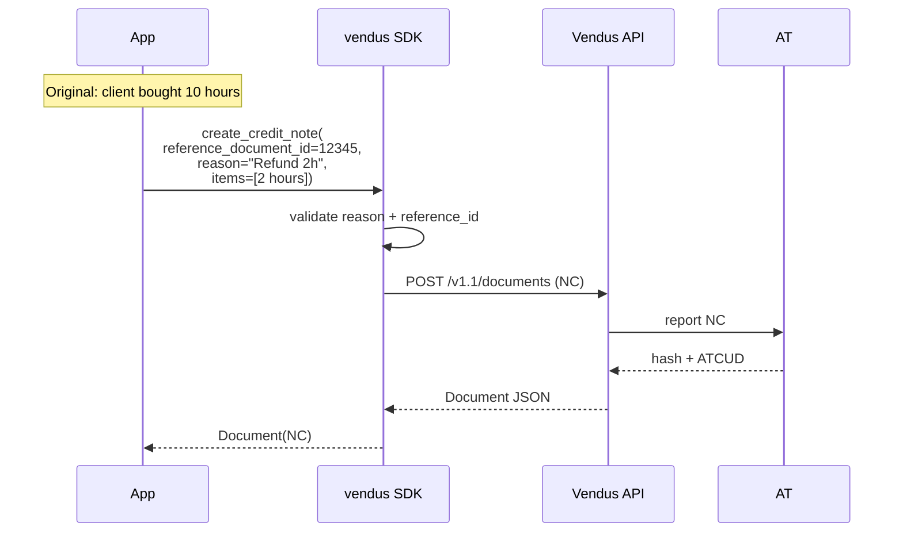

# Credit Note (NC)

## What it is

A Credit Note (NC) cancels or partially credits a previously issued document (FT or FS). It is the legal mechanism for returns, retroactive discounts, or correcting wrong invoices.

- **Always references** an original document (`reference_document_id`)
- **Reason is mandatory** (`reason`) — required by AT
- Client should match the original document's client
- Can be partial (refunding only some items)

## Flow



## Full example

```python
from decimal import Decimal
from vendus import ClientData, DocumentItem, TaxCategory, VendusClient

client = VendusClient.from_env()

# Assume invoice.id was stored from the original issue
original_invoice_id = 12345

nc = client.documents.create_credit_note(
    register_id=1,
    reference_document_id=original_invoice_id,
    reason="Client returned 2 consulting hours",
    client=ClientData(name="Acme Lda", fiscal_id="123456789"),
    items=[
        DocumentItem(
            description="Consulting (credited)",
            quantity=Decimal("2"),
            unit_price=Decimal("75.00"),
            tax_category=TaxCategory.NORMAL,
        ),
    ],
    external_reference="REFUND-2026-001",
)

print(nc.number)         # "NC 2026/4"
print(nc.gross_amount)   # Decimal("184.50") — 2 × 75 × 1.23
```

## Parameters

| Parameter | Type | Required | Description |
|---|---|---|---|
| `register_id` | `int` | Yes | POS register ID configured in Vendus |
| `reference_document_id` | `int` | Yes | ID of the original FT/FS being credited |
| `reason` | `str` | Yes | Reason for the credit note (required by AT) |
| `items` | `list[DocumentItem]` | Yes | Items to credit (can be a subset of the original) |
| `client` | `ClientData \| None` | No | Should match the original document's client |
| `external_reference` | `str` | No | Enables safe POST retries |

## Async variant

```python
nc = await client.documents.create_credit_note_async(
    register_id=1,
    reference_document_id=12345,
    reason="...",
    items=[...],
)
```

## Notes

1. **Full vs partial NC:** if refunding the whole amount, replicate all items. For partial refunds, include only the items/quantities to credit.
2. **NC is not cancellation:** an NC **credits** the value but keeps the original document. To fully void, use `client.documents.cancel(id)` instead.
3. **Consistent client:** if the original was to Final Consumer, the NC should also omit `client`.
