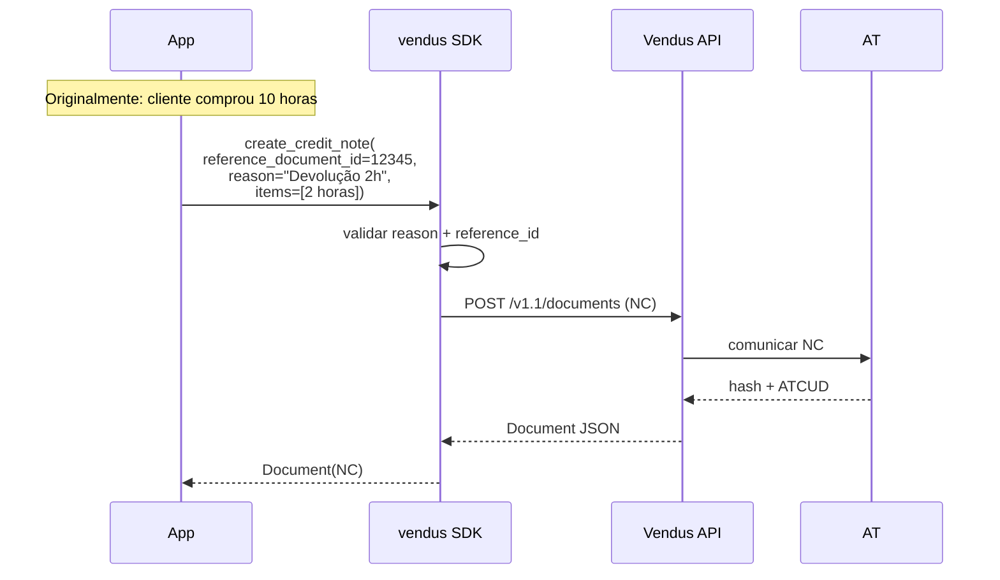

# Nota de Crédito (NC)

## O que é

A Nota de Crédito (NC) anula ou credita parcialmente um documento já emitido (FT ou FS). É o mecanismo legal para devoluções, descontos retroativos, ou correções de faturas erradas.

- **Referencia sempre** um documento original (`reference_document_id`)
- **Motivo obrigatório** (`reason`) — exigido pela AT
- O cliente deve coincidir com o do documento original
- Pode ser parcial (devolução de só alguns itens)

## Fluxo



## Exemplo completo

```python
from decimal import Decimal
from vendus import VendusClient, ClientData, DocumentItem

client = VendusClient.from_env()

# Assume que invoice.id foi guardado da emissão original
original_invoice_id = 12345

nc = client.documents.create_credit_note(
    register_id=1,
    reference_document_id=original_invoice_id,
    reason="Cliente devolveu 2 horas de consultoria",
    client=ClientData(name="Acme Lda", fiscal_id="123456789"),
    items=[
        DocumentItem(
            description="Consultoria (creditada)",
            quantity=Decimal("2"),
            unit_price=Decimal("75.00"),
            tax_rate=Decimal("23"),
        ),
    ],
    external_reference="REFUND-2026-001",
)

print(nc.number)         # "NC 2026/4"
print(nc.gross_amount)   # Decimal("184.50") — 2 × 75 × 1.23
```

## Parâmetros

| Parâmetro | Tipo | Obrigatório | Descrição |
|---|---|---|---|
| `register_id` | `int` | Sim | ID do POS configurado na Vendus |
| `reference_document_id` | `int` | Sim | ID da FT/FS original a creditar |
| `reason` | `str` | Sim | Motivo da NC (exigido pela AT) |
| `items` | `list[DocumentItem]` | Sim | Itens a creditar (podem ser subset do original) |
| `client` | `ClientData \| None` | Não | Deve coincidir com o cliente do original |
| `external_reference` | `str` | Não | Habilita retry seguro do POST |

## Variante async

```python
nc = await client.documents.create_credit_note_async(
    register_id=1,
    reference_document_id=12345,
    reason="...",
    items=[...],
)
```

## Notas

1. **NC total vs parcial:** se devolves o total, replica todos os itens. Se devolves uma parte, inclui só os itens/quantidades a creditar.
2. **Não é cancelamento:** uma NC **credita** o valor mas mantém o documento original. Para cancelar completamente, usa `client.documents.cancel(id, reason)` em alternativa.
3. **Cliente coerente:** se o original foi a Consumidor Final, a NC também deve omitir `client`.
