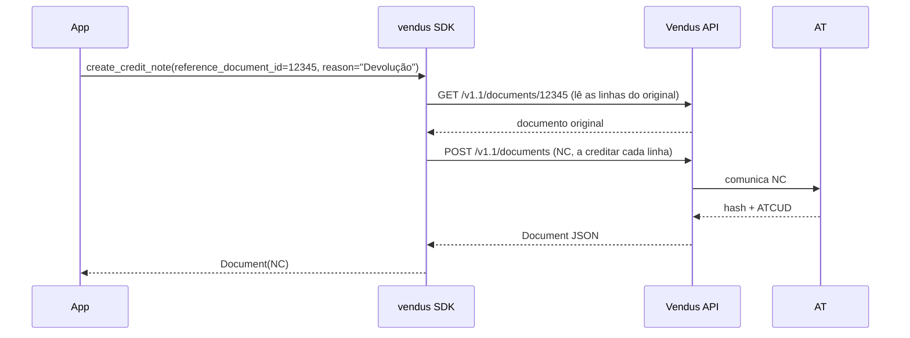

# Nota de Crédito (NC)

## O que é

Uma Nota de Crédito (NC) credita uma fatura emitida anteriormente (FT ou FR). É o mecanismo legal para devoluções, reembolsos e correções — e a **única** forma de reverter uma fatura fiscal, que não pode ser cancelada.

- **Referencia sempre** um documento original (`reference_document_id`)
- **Motivo obrigatório** (`reason`) — exigido pela AT
- Credita o documento original **por inteiro**: o SDK vai buscar o original e replica as suas linhas, por isso o cliente e os valores vêm dele (créditos parciais não são suportados no v0.1)

## Fluxo



## Exemplo completo

```python
from vendus import VendusClient

client = VendusClient.from_env()

# invoice.id foi guardado quando emitiste o original
original_invoice_id = 12345

nc = client.documents.create_credit_note(
    reference_document_id=original_invoice_id,
    reason="Cliente devolveu o serviço",
    external_reference="REFUND-2026-001",
)

print(nc.number)         # "NC 2026/4"
print(nc.gross_amount)   # o valor creditado
```

## Parâmetros

| Parâmetro | Tipo | Obrigatório | Descrição |
|---|---|---|---|
| `reference_document_id` | `int` | Sim | id da FT/FR original a creditar |
| `reason` | `str` | Sim | Motivo da nota de crédito (exigido pela AT) |
| `external_reference` | `str` | Não | Permite retries seguros do POST |
| `mode` | `DocumentMode \| None` | Não | `TESTS` para uma NC de teste (não-fiscal) |

O cliente, os itens e os valores são lidos do documento original — não os passas.

## Variante async

```python
nc = await client.documents.create_credit_note_async(
    reference_document_id=12345,
    reason="...",
)
```

## Notas

1. **Só crédito total (v0.1):** o SDK credita todas as linhas do original. Créditos parciais (algumas linhas/quantidades) ficam para o futuro.
2. **A NC é como se reverte uma fatura:** faturas fiscais (FT/FR) **não podem ser canceladas** — o `cancel()` rejeita-as. Emite uma NC para creditar o original.
3. **Apenas documentos reais:** o original tem de ser consultável, por isso as notas de crédito funcionam sobre documentos **reais**, não sobre os de modo teste (que não são endereçáveis via `/documents/{id}`).
