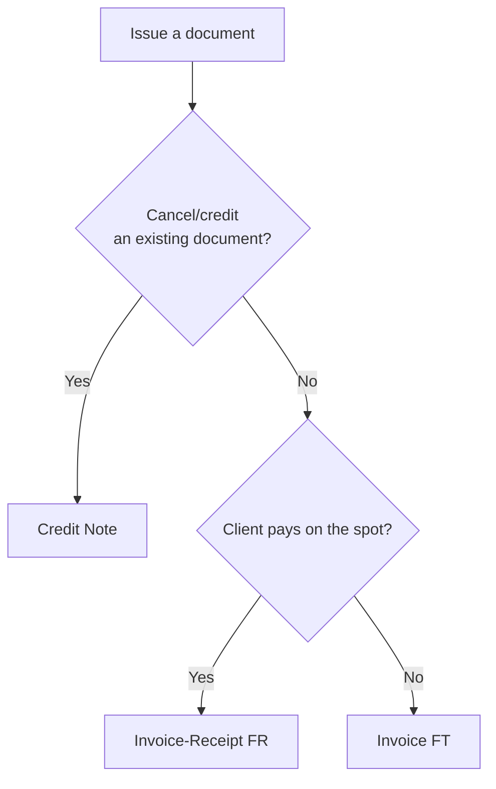

# Which document type to choose?

AT defines several fiscal document types. The SDK supports the three essential for MVP:

| Type | AT code | When to use |
|---|---|---|
| **Invoice (FT)** | FT | Sale where the client pays later (on credit, net 30) |
| **Invoice-Receipt (FR)** | FR | Sale where the client pays **on the spot** (invoice + receipt in one) |
| **Credit Note (NC)** | NC | Cancel or partially credit a previously issued document |

## Decision tree



## Three client shapes

All three creation methods accept the same three identification forms:

```python
from vendus import ClientData

# 1. With NIF (typical B2B or B2C with NIF)
ClientData(name="Acme Lda", fiscal_id="123456789")

# 2. Name only (B2C without NIF)
ClientData(name="João Silva")

# 3. Final consumer — OMIT the client argument entirely
# (do not pass anything, not ClientData(), not fiscal_id="999999990")
```

!!! danger "Never use 999999990"
    The SDK explicitly rejects `fiscal_id="999999990"`. For final consumer, omit the `client` argument.

## Automatic validations

The SDK validates locally **before** hitting the API:

- **Portuguese NIF:** mod 11 algorithm (rejects bad check digits)
- **NIF 999999990:** explicitly rejected
- **Items:** at least one, `quantity > 0`, `0 ≤ tax_rate ≤ 100`
- **Credit Note:** requires `reference_document_id` and `reason`
- **Cancellation:** requires `reason`

## Next steps

- [Invoice (FT)](invoice.md)
- [Invoice-Receipt (FR)](invoice-receipt.md)
- [Credit Note (NC)](credit-note.md)
