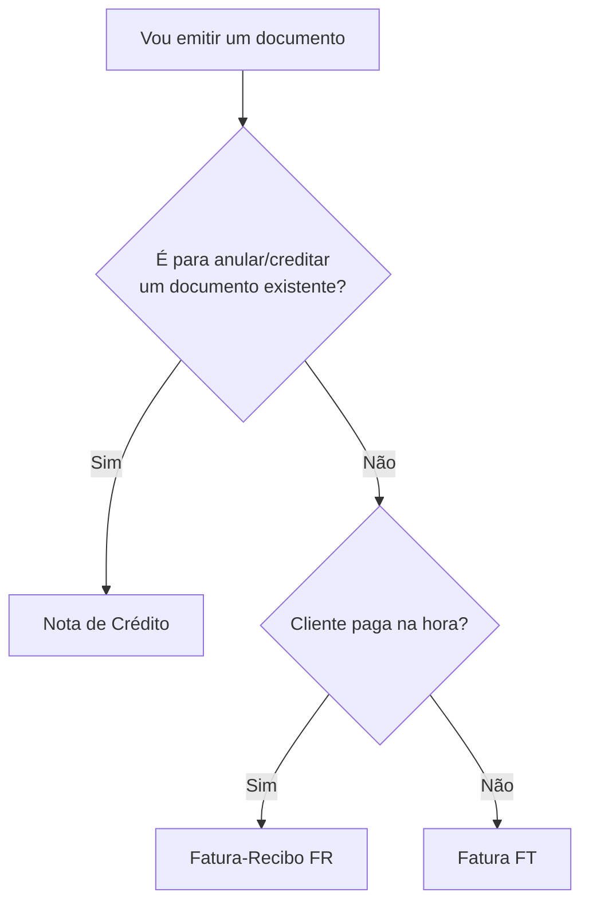

# Qual tipo de documento escolher?

A AT define vários tipos de documentos fiscais. O SDK suporta os três essenciais para o MVP:

| Tipo | Código AT | Quando usar |
|---|---|---|
| **Fatura (FT)** | FT | Venda em que o cliente paga depois (a crédito, a 30 dias) |
| **Fatura-Recibo (FR)** | FR | Venda em que o cliente paga **na hora** (factura + recibo num só) |
| **Nota de Crédito (NC)** | NC | Anular ou creditar parcialmente um documento já emitido |

## Árvore de decisão



## Os 3 formatos de cliente

Todos os três métodos de criação aceitam as mesmas três formas de identificação:

```python
from vendus import ClientData

# 1. Com NIF (B2B típico ou B2C que pediu NIF)
ClientData(name="Acme Lda", fiscal_id="123456789")

# 2. Só com nome (B2C sem NIF)
ClientData(name="João Silva")

# 3. Consumidor final — OMITIR o argumento client por completo
# (não passes nada, nem ClientData(), nem fiscal_id="999999990")
```

!!! danger "Nunca uses 999999990"
    O SDK rejeita explicitamente `fiscal_id="999999990"`. Para consumidor final, omite o argumento `client`.

## Validações automáticas

O SDK valida localmente **antes** de tocar na API:

- **NIF português:** algoritmo mod 11 (rejeita check digits errados)
- **NIF 999999990:** explicitamente rejeitado
- **Items:** pelo menos um, `quantity > 0`, uma `tax_category` (NORMAL/INTERMEDIATE/REDUCED/EXEMPT/OTHER)
- **Nota de Crédito:** exige `reference_document_id` e `reason`
- **Cancelamento:** exige `reason`

## Próximos passos

- [Fatura (FT)](invoice.md)
- [Fatura-Recibo (FR)](invoice-receipt.md)
- [Nota de Crédito (NC)](credit-note.md)
