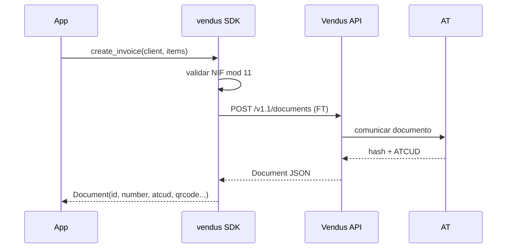

# Fatura (FT)

## O que é

A Fatura (FT) é o documento fiscal padrão em Portugal. Obrigatória para:

- Transações B2B
- B2C onde o cliente fornece NIF
- B2C onde o pagamento é diferido (a crédito); se o cliente paga na hora, usa Fatura-Recibo (FR)

A Vendus comunica automaticamente o documento à AT (hash, ATCUD, QR code).

## Fluxo



## Exemplo completo

```python
from decimal import Decimal
from vendus import VendusClient, ClientData, DocumentItem

client = VendusClient.from_env()

invoice = client.documents.create_invoice(
    register_id=1,
    client=ClientData(
        name="Acme Lda",
        fiscal_id="123456789",
        email="billing@acme.pt",
        address="Rua das Flores 123",
        postalcode="1000-001",
        city="Lisboa",
        country="PT",
    ),
    items=[
        DocumentItem(
            description="Consultoria",
            quantity=Decimal("10"),
            unit_price=Decimal("75.00"),
            tax_rate=Decimal("23"),
        ),
    ],
    external_reference="ORD-2026-001",
)

print(invoice.id)             # 12345
print(invoice.number)         # "FT 2026/123"
print(invoice.gross_amount)   # Decimal("922.50")
print(invoice.atcud)          # "AAAAAAAA-123"
print(invoice.qrcode)         # "A:123456789*B:..."
```

## Parâmetros

| Parâmetro | Tipo | Obrigatório | Descrição |
|---|---|---|---|
| `register_id` | `int` | Sim | ID do POS configurado na Vendus |
| `items` | `list[DocumentItem]` | Sim | Pelo menos um item |
| `client` | `ClientData \| None` | Não | Omitir = consumidor final |
| `external_reference` | `str` | Não | Habilita retry seguro do POST |

## Três formatos de cliente

```python
# Com NIF (B2B)
client.documents.create_invoice(
    register_id=1, items=[...],
    client=ClientData(name="Acme Lda", fiscal_id="123456789"),
)

# Só com nome (cliente não deu NIF)
client.documents.create_invoice(
    register_id=1, items=[...],
    client=ClientData(name="João Silva"),
)

# Consumidor final
client.documents.create_invoice(register_id=1, items=[...])
```

## Variante async

```python
invoice = await client.documents.create_invoice_async(
    register_id=1,
    client=ClientData(name="Acme Lda", fiscal_id="123456789"),
    items=[...],
)
```

## Itens isentos de IVA

Quando `tax_rate=0`, a AT exige um código de isenção (M01-M99):

```python
from vendus import DocumentItem, TaxExemption

DocumentItem(
    description="Serviço de educação",
    quantity=Decimal("1"),
    unit_price=Decimal("100.00"),
    tax_rate=Decimal("0"),
    tax_exemption=TaxExemption.M07,  # Isento Artigo 9.º do CIVA
)
```

Códigos comuns:

| Código | Significado |
|---|---|
| M01 | Artigo 16.º, n.º 6 do CIVA |
| M07 | Isento Artigo 9.º (saúde, educação) |
| M10 | Regime de IVA de caixa |
| M16 | Isento Artigo 14.º RITI (intracomunitária) |
| M99 | Não sujeito; não tributado |

## Cancelar uma fatura

```python
cancelled = client.documents.cancel(
    document_id=invoice.id,
    reason="Erro no cliente",
)
```

A AT exige `reason`. Cancelamento é não-idempotente — não passes max_retries > 0.

## Notas

1. **`unit_price` é bruto** (com IVA incluído). O SDK não recalcula.
2. **`external_reference` é a tua âncora de idempotência.** Sem ele, um POST que falhe a meio não pode ser retentado em segurança.
3. **AT é opaca** — `hash`, `atcud` e `qrcode` vêm prontos da Vendus. Nunca precisas falar com a AT diretamente.
4. **`raw_response`** contém o JSON cru se precisares de campos que o SDK ainda não modela.
