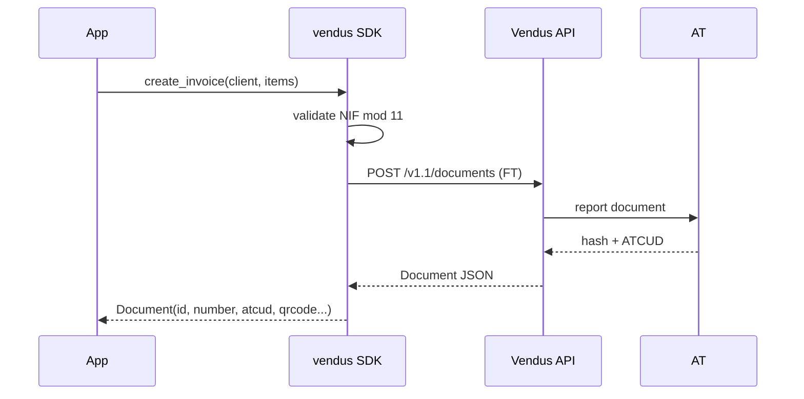

# Invoice (FT)

## What it is

The Invoice (FT) is the standard Portuguese fiscal document. Required for:

- B2B transactions
- B2C where the client provides a NIF
- B2C where payment is deferred (on credit); if the client pays on the spot, use Invoice-Receipt (FR)

Vendus automatically reports the document to AT (hash, ATCUD, QR code).

## Flow



## Full example

```python
from decimal import Decimal
from vendus import ClientData, DocumentItem, TaxCategory, VendusClient

client = VendusClient.from_env()

invoice = client.documents.create_invoice(
    register_id=1,
    client=ClientData(
        name="Acme Lda",
        fiscal_id="123456789",
        email="billing@acme.pt",
        address="Rua das Flores 123",
        postalcode="1000-001",
        city="Lisboa",
        country="PT",
    ),
    items=[
        DocumentItem(
            description="Consulting",
            quantity=Decimal("10"),
            unit_price=Decimal("75.00"),
            tax_category=TaxCategory.NORMAL,
        ),
    ],
    external_reference="ORD-2026-001",
)

print(invoice.id)             # 12345
print(invoice.number)         # "FT 2026/123"
print(invoice.gross_amount)   # Decimal("922.50")
print(invoice.atcud)          # "AAAAAAAA-123"
print(invoice.qrcode)         # "A:123456789*B:..."
```

## Parameters

| Parameter | Type | Required | Description |
|---|---|---|---|
| `register_id` | `int` | Yes | POS register ID configured in Vendus |
| `items` | `list[DocumentItem]` | Yes | At least one item |
| `client` | `ClientData \| None` | No | Omit = final consumer |
| `external_reference` | `str` | No | Enables safe POST retries |

## Three client shapes

```python
# With NIF (B2B)
client.documents.create_invoice(
    register_id=1, items=[...],
    client=ClientData(name="Acme Lda", fiscal_id="123456789"),
)

# Name only (client did not provide NIF)
client.documents.create_invoice(
    register_id=1, items=[...],
    client=ClientData(name="João Silva"),
)

# Final consumer
client.documents.create_invoice(register_id=1, items=[...])
```

## Async variant

```python
invoice = await client.documents.create_invoice_async(
    register_id=1,
    client=ClientData(name="Acme Lda", fiscal_id="123456789"),
    items=[...],
)
```

## VAT-exempt items

When `tax_category=TaxCategory.EXEMPT`, AT requires an exemption code (M01-M99):

```python
from vendus import DocumentItem, TaxExemption

DocumentItem(
    description="Education service",
    quantity=Decimal("1"),
    unit_price=Decimal("100.00"),
    tax_category=TaxCategory.EXEMPT,
    tax_exemption=TaxExemption.M07,  # Exempt Article 9.º CIVA
)
```

Common codes:

| Code | Meaning |
|---|---|
| M01 | Article 16.º, n.º 6 CIVA |
| M07 | Exempt Article 9.º (health, education) |
| M10 | Cash VAT regime |
| M16 | Exempt Article 14.º RITI (intra-community) |
| M99 | Not subject; not taxed |

## Cancel an invoice

```python
cancelled = client.documents.cancel(document_id=invoice.id)
```

Vendus has no API field for a cancellation reason, so none is sent. Cancellation is non-idempotent — do not pass max_retries > 0.

## Notes

1. **`unit_price` is gross** (includes VAT). The SDK does not recompute.
2. **`external_reference` is your idempotency anchor.** Without it, a POST that fails mid-flight cannot be safely retried.
3. **AT is opaque** — `hash`, `atcud`, and `qrcode` come ready from Vendus. You never need to talk to AT directly.
4. **`raw_response`** holds the raw JSON if you need fields the SDK doesn't model yet.
