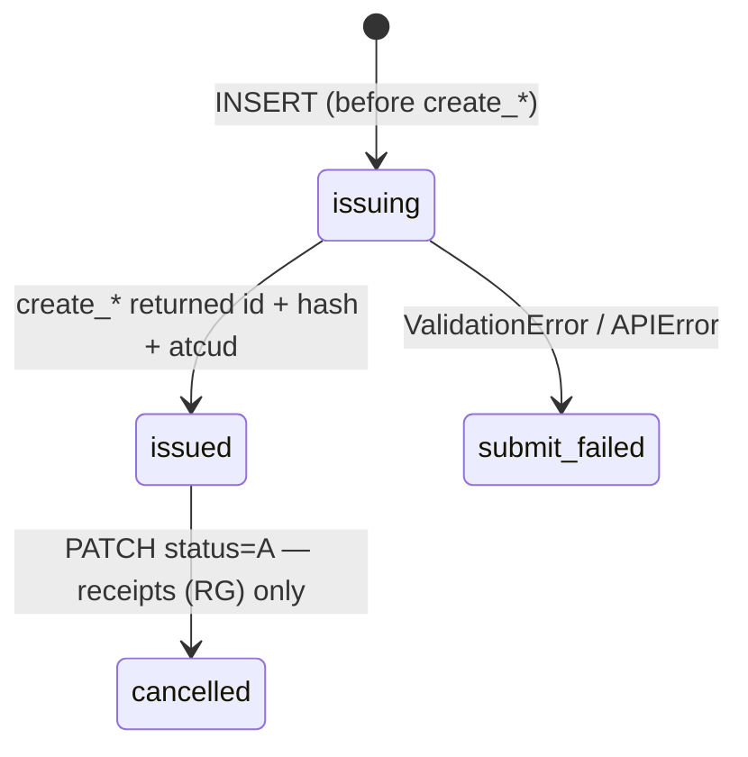

# Persisting documents

How to store the fiscal documents you issue through Vendus so that nothing is lost
when a process crashes mid-issue, a retry fires, or you need to **reprint a legal
invoice years later**.

A real-mode Vendus document is a **permanent, AT-reported fiscal record**: you can't
edit it, and an invoice (FT), invoice-receipt (FR) or credit note (NC) can't even be
cancelled — you correct it by issuing a *new* credit note. So persistence here is
about two things: never losing the handle to a real fiscal document you created, and
keeping the AT compliance data (`number`, `hash`, `atcud`, `qrcode`) so you can
reprint and prove it.

This recipe gives you a **reference schema** (PostgreSQL, with type/size rationale and
notes for other engines), the **lifecycle**, and the **functions** that drive it. It
is framework-agnostic — pair it with the [FastAPI](fastapi.md), [Django](django.md) or
[Flask](flask.md) recipe for the HTTP layer.

## The one rule: write before you issue

Insert the row — keyed by **your** `external_reference`, `status='issuing'` — **before**
you call `create_invoice()`, in the same process, committed:

```
INSERT (status='issuing', external_reference)  →  create_invoice(...)  →  UPDATE (status='issued', vendus_id, number, hash, atcud, qrcode, …)
```

If the process dies between the POST succeeding at Vendus and you storing the
response, you have issued a **real fiscal document — already reported to the AT — that
your system has no record of**. That is not a lost sale; it is a legal document
floating free. The write-ahead row makes that orphan *findable*: a reconciliation job
can list it and decide what to do.

Write-ahead has a second, invoicing-specific benefit. Vendus has **no idempotency
keys** — `external_reference` is its only deduplication anchor, and the SDK retries a
`POST` **only when `external_reference` is set** (rule R3). Writing it first means a
retry reuses the same anchor instead of minting a duplicate FT.

## The lifecycle



`issuing` and `submit_failed` are **local-only** states — Vendus never sees them.
`issued`/`cancelled` (plus `paid`/`partially_paid`, which Vendus sets for paid flows
like an FR) map to the SDK's `DocumentStatus` enum.

Two things that are *not* transitions of this row:

- **Cancellation.** Only a receipt (RG) can be cancelled (`PATCH status=A`). **FT, FR
  and NC cannot** — the SDK refuses them. You reverse an invoice by issuing a credit
  note, which is a **new** document (a new row) whose `corrects_document_id` points
  back here. The original stays `issued` forever.
- **Editing.** Once issued, `number`, `hash`, `atcud` and `qrcode` are immutable AT
  data. Never `UPDATE` them.

## Schema (PostgreSQL)

Two tables: the document (current state + fiscal data) and an append-only event log.

```sql
CREATE TABLE vendus_documents (
    id                   BIGINT GENERATED ALWAYS AS IDENTITY PRIMARY KEY,  -- your PK

    -- YOUR correlation key. You generate it and pass it to create_*() as
    -- external_reference. It is Vendus's only dedup anchor (there are no
    -- idempotency keys) and the SDK retries a POST only when it is set (R3).
    -- Always match on this.
    external_reference   TEXT NOT NULL UNIQUE,

    -- Vendus's document id — the handle for get()/create_credit_note().
    -- NULL until the create call returns. Integer on the wire; BIGINT is
    -- future-proof and free.
    vendus_id            BIGINT UNIQUE,

    -- The legal document number, e.g. 'FT 2026/123'. THIS is the reprint key
    -- and what prints on the document. Real vs test tell apart by the series
    -- prefix: 'FT 01P2026/…' (real) vs 'FT T01P2026/…' (test). Store verbatim.
    number               TEXT,

    -- Vendus type code (FT/FS/FR/RG/NC/…). Unknown codes normalize to 'UNKNOWN'
    -- in the SDK; the raw code is always kept in raw_response['type']. 2 chars
    -- today, but size for the 'UNKNOWN' sentinel.
    type                 VARCHAR(16) NOT NULL,
    subtype              VARCHAR(16),

    -- 'normal' | 'tests'. YOU set this at issue time; Vendus does not echo it
    -- as a typed field, so STORE IT. It is load-bearing: a test document is
    -- non-fiscal AND is not retrievable via get()/create_credit_note() (it
    -- lives in a separate space). Never rely on vendus_id for a test row.
    mode                 VARCHAR(8) NOT NULL,

    -- Money is NUMERIC, never float (R2). Gross includes VAT, net excludes it.
    -- The SDK never populates tax_amount (R1 lists it as derived), so compute
    -- tax = gross - net yourself. Vendus computes the authoritative gross/net,
    -- so these are NULL until issued.
    gross_amount         NUMERIC(13,2),
    net_amount           NUMERIC(13,2),
    tax_amount           NUMERIC(13,2),

    -- AT compliance data — the reason you keep fiscal records at all. Keep all
    -- of it so you can reprint the legal document and its QR code offline.
    -- These can be long AT strings → TEXT avoids truncation.
    hash                 TEXT,   -- AT document hash
    atcud                TEXT,   -- ATCUD, e.g. 'AAAAAAAA-123'
    qrcode               TEXT,   -- full AT QR-code payload
    -- AT-generated id. Empty for test documents AND empty at create time even
    -- for real ones (until Vendus reports them). Do NOT use it to decide
    -- real vs test — the series prefix / your `mode` column is the tell.
    tax_authority_id     TEXT,

    -- Normalized lifecycle (CHECK, not a native ENUM — adding a value later is
    -- an ALTER, not a type migration). 'issuing'/'submit_failed' are local-only.
    status               VARCHAR(16) NOT NULL DEFAULT 'issuing'
        CHECK (status IN ('issuing', 'submit_failed', 'draft', 'issued',
                          'cancelled', 'paid', 'partially_paid')),

    -- For a credit note (NC): the row of the original it credits. Self-FK;
    -- NULL for everything else.
    corrects_document_id BIGINT REFERENCES vendus_documents (id),

    -- Link to a person via YOUR users table — do NOT copy the client's NIF /
    -- email / phone here. That PII is exactly what the SDK redacts from logs
    -- (R6). You provide the client at issue time; the create response does not
    -- echo it. See "Security, PII & retention".
    customer_id          BIGINT,   -- FK into your own customers table

    -- Vendus returns date / local_time / system_time; keep your own issued_at
    -- (when your app committed the issued state) as well.
    doc_date             DATE,          -- Vendus 'date'
    system_time          TIMESTAMPTZ,   -- Vendus 'system_time'
    initiated_at         TIMESTAMPTZ NOT NULL DEFAULT now(),
    issued_at            TIMESTAMPTZ,
    updated_at           TIMESTAMPTZ NOT NULL DEFAULT now()
);

CREATE INDEX vendus_documents_status_idx    ON vendus_documents (status);
CREATE INDEX vendus_documents_vendus_id_idx ON vendus_documents (vendus_id);
CREATE INDEX vendus_documents_number_idx    ON vendus_documents (number);
```

What is deliberately **not** here: no client NIF / email / phone (PII → `customer_id`
FK), and no line items. Vendus is the system of record for an issued document, and its
full detail is in `raw_response`; keep that in the event
log below. If you must *query* by line, add a child table mirroring `DocumentItem`
(`description`, `quantity`, `unit_price`, `tax_category`, `tax_exemption`, `discount`).

```sql
CREATE TABLE vendus_document_events (
    id           BIGINT GENERATED ALWAYS AS IDENTITY PRIMARY KEY,
    document_id  BIGINT NOT NULL REFERENCES vendus_documents (id),

    type         VARCHAR(24) NOT NULL
        CHECK (type IN ('initiated', 'create_requested', 'create_ok',
                        'create_failed', 'cancelled', 'credited', 'reconciled')),
    source       VARCHAR(16) NOT NULL
        CHECK (source IN ('api', 'reconciliation', 'backoffice', 'local')),

    -- The raw Vendus response / error. raw_response is the SDK escape hatch
    -- (R9), your reprint-of-last-resort and your audit trail — but raw payloads
    -- can carry client PII (a GET returns a client block), so store REDACTED.
    raw          JSONB,
    error_code   VARCHAR(16),   -- Vendus error code on failure (e.g. 'P001')

    -- GDPR: a purge job may null out `raw` past this date. The fiscal record in
    -- vendus_documents (number/hash/atcud) is a legal record kept for years;
    -- the raw PII-bearing payloads do not have to be.
    purge_after  TIMESTAMPTZ,
    created_at   TIMESTAMPTZ NOT NULL DEFAULT now()
);

CREATE INDEX vendus_document_events_doc_idx ON vendus_document_events (document_id);
```

### Lock the history down

`vendus_document_events` is append-only. Enforce it with grants, not discipline:

```sql
GRANT SELECT, INSERT ON vendus_document_events TO app_role;   -- no UPDATE, no DELETE
GRANT SELECT, INSERT, UPDATE ON vendus_documents TO app_role; -- no DELETE:
-- a cancelled document is a status, not a missing row, and a fiscal record is
-- never deleted.
```

(The retention purge runs under a separate maintenance role that may
`UPDATE vendus_document_events SET raw = NULL` past `purge_after`.)

## Column reference

Every column that comes from the SDK, and its type. `Document` fields are what
`create_*()` / `get()` return; *input* fields are what you passed in (Vendus does not
echo them as typed fields).

| Column | Source | SDK / Python type | SQL type | Notes |
|---|---|---|---|---|
| `external_reference` | *input* | `str` | `TEXT` UNIQUE | you generate it; the dedup anchor (R3) |
| `vendus_id` | `Document.id` | `int` | `BIGINT` | handle for `get()` / credit notes |
| `number` | `Document.number` | `str` | `TEXT` | legal reprint key, e.g. `FT 2026/123` |
| `type` | `Document.type` | `DocumentType` | `VARCHAR(16)` | 2-char code or `UNKNOWN` |
| `subtype` | `Document.subtype` | `str \| None` | `VARCHAR(16)` | |
| `mode` | *input* | `DocumentMode` | `VARCHAR(8)` | `normal` / `tests` — store it |
| `gross_amount` | `Document.gross_amount` | `Decimal` | `NUMERIC(13,2)` | incl. VAT; **never float** (R2) |
| `net_amount` | `Document.net_amount` | `Decimal` | `NUMERIC(13,2)` | excl. VAT |
| `tax_amount` | *derived* | `Decimal` | `NUMERIC(13,2)` | the SDK never returns it — compute `gross - net` |
| `hash` | `Document.hash` | `str \| None` | `TEXT` | AT hash |
| `atcud` | `Document.atcud` | `str \| None` | `TEXT` | ATCUD |
| `qrcode` | `Document.qrcode` | `str \| None` | `TEXT` | full QR payload (long) |
| `tax_authority_id` | `Document.tax_authority_id` | `str \| None` | `TEXT` | empty until AT-reported |
| `status` | `Document.status` | `DocumentStatus` | `VARCHAR(16)` | normalized enum |
| `doc_date` | `Document.date` | `datetime \| None` | `DATE` | use `TIMESTAMPTZ` if you need the time |
| `system_time` | `Document.system_time` | `datetime \| None` | `TIMESTAMPTZ` | |
| *(raw)* | `Document.raw_response` | `dict` | `JSONB` | in the event log, redacted (R9) |

**Sizing rationale.** `NUMERIC(13,2)` holds up to `99 999 999 999.99`. `type` is 2
chars today but the `UNKNOWN` sentinel is 7 → `VARCHAR(16)`. `mode` is ≤6 (`normal`) → `VARCHAR(8)`.
`number`, `hash`, `atcud` and `qrcode` are open-ended AT strings — in PostgreSQL `TEXT`
and `VARCHAR` are the same type with no length limit, so `TEXT` avoids arbitrary
truncation; on MySQL / SQL Server use `VARCHAR(64)` for `number`/`atcud` and `TEXT` for
`hash`/`qrcode`.

## The functions

Shown with plain SQL placeholders (`%s`) — adapt to your driver/ORM.

### 1. `begin_document()` — write-ahead

```python
import uuid

def begin_document(db, *, doc_type: str, mode: str, customer_id=None) -> str:
    # Non-guessable on purpose: external_reference can travel in logs/URLs, and
    # a random suffix keeps retries from colliding. It is also the dedup anchor.
    external_reference = f"DOC-{uuid.uuid4().hex[:16]}"

    db.execute(
        """INSERT INTO vendus_documents (external_reference, type, mode, customer_id)
           VALUES (%s, %s, %s, %s)""",
        (external_reference, doc_type, mode, customer_id),
    )
    db.execute(
        """INSERT INTO vendus_document_events (document_id, type, source)
           SELECT id, 'initiated', 'local' FROM vendus_documents
           WHERE external_reference = %s""",
        (external_reference,),
    )
    db.commit()          # ← committed BEFORE Vendus hears about it
    return external_reference
```

### 2. `issue_invoice()` — record what Vendus returned

```python
from vendus import APIError, DocumentItem, DocumentMode, ValidationError, VendusClient

def issue_invoice(db, client: VendusClient, *, register_id, items, customer_id=None,
                  mode="normal") -> "Document":
    ext = begin_document(db, doc_type="FT", mode=mode, customer_id=customer_id)
    try:
        doc = client.documents.create_invoice(
            register_id=register_id,
            items=items,
            external_reference=ext,          # ← the write-ahead key = the dedup anchor
            mode=DocumentMode(mode),          # ← never rely on the register default (R16)
        )
    except (ValidationError, APIError) as exc:
        db.execute(
            """UPDATE vendus_documents SET status = 'submit_failed', updated_at = now()
               WHERE external_reference = %s""",
            (ext,),
        )
        _add_event(db, ext, "create_failed", "api",
                   raw={"error": str(exc)}, error_code=getattr(exc, "error_code", None))
        db.commit()
        raise

    db.execute(
        """UPDATE vendus_documents SET
               status = 'issued', vendus_id = %s, number = %s, type = %s, subtype = %s,
               gross_amount = %s, net_amount = %s, tax_amount = %s,
               hash = %s, atcud = %s, qrcode = %s, tax_authority_id = %s,
               doc_date = %s, system_time = %s, issued_at = now(), updated_at = now()
           WHERE external_reference = %s""",
        (doc.id, doc.number, doc.type.value, doc.subtype,
         doc.gross_amount, doc.net_amount, doc.gross_amount - doc.net_amount,
         doc.hash, doc.atcud, doc.qrcode, doc.tax_authority_id,
         doc.date, doc.system_time, ext),
    )
    _add_event(db, ext, "create_ok", "api", raw=redact_pii(doc.raw_response))
    db.commit()
    return doc
```

### 3. `credit_document()` — the invoicing "refund"

An FT/FR/NC can't be cancelled; you reverse it with a **credit note**, which is a new
document referencing the original (R13). The original must be a **real, retrievable**
document — a test-mode document can't be credited.

```python
def credit_document(db, client, *, original_external_reference: str, reason: str):
    row = db.fetch_one(
        "SELECT id, vendus_id, mode FROM vendus_documents WHERE external_reference = %s",
        (original_external_reference,),
    )
    if row.mode != "normal":
        raise ValueError("test-mode documents can't be credited (not retrievable)")

    nc_ext = begin_document(db, doc_type="NC", mode="normal")
    nc = client.documents.create_credit_note(
        reference_document_id=row.vendus_id,   # the REAL original's Vendus id
        reason=reason,
        external_reference=nc_ext,
        mode=DocumentMode.NORMAL,
    )
    db.execute(
        """UPDATE vendus_documents SET
               status = 'issued', vendus_id = %s, number = %s, type = 'NC',
               gross_amount = %s, net_amount = %s, tax_amount = %s,
               hash = %s, atcud = %s, qrcode = %s, tax_authority_id = %s,
               corrects_document_id = %s, issued_at = now(), updated_at = now()
           WHERE external_reference = %s""",
        (nc.id, nc.number, nc.gross_amount, nc.net_amount, nc.gross_amount - nc.net_amount,
         nc.hash, nc.atcud, nc.qrcode, nc.tax_authority_id, row.id, nc_ext),
    )
    _add_event(db, nc_ext, "credited", "api", raw=redact_pii(nc.raw_response))
    db.commit()
    return nc
```

### 4. `reconcile()` — the safety net

```python
def reconcile(db, client) -> None:
    # (a) Orphans: 'issuing' older than a few minutes. The crash happened
    #     between the INSERT and the response. For a REAL-mode row the document
    #     may already exist at Vendus. There is no idempotency key, so DO NOT
    #     blindly re-issue (you would risk a duplicate FT). Two safe routes:
    #       - list recent documents and match your external_reference against
    #         what Vendus echoes back (check raw_response), then attach; or
    #       - flag the row for a human to reconcile against the Vendus backoffice.
    for row in db.fetch_all(
        """SELECT id, external_reference FROM vendus_documents
           WHERE status = 'issuing'
             AND initiated_at < now() - interval '15 minutes'"""
    ):
        ...  # attach if found, else mark for review; event(type='reconciled')

    # (b) Purge raw payloads past retention. The fiscal state stays; the PII goes.
    db.execute(
        "UPDATE vendus_document_events SET raw = NULL WHERE purge_after < now()"
    )
    db.commit()
```

Run it from cron / Celery beat. It is intentionally boring — boring reconciliation is
the kind that works at 3 a.m.

## Quirks checklist

Live-verified facts (rule R16) and what the schema does about each:

| # | Quirk | What the schema does |
|---|---|---|
| 1 | No idempotency keys; `external_reference` is the only dedup anchor, and the SDK retries a POST only when it is set (R3) | `external_reference NOT NULL UNIQUE`, written before the call |
| 2 | `mode` defaults to the register's mode → an omitted `mode` can silently issue a **test** document | `mode` column `NOT NULL`, set explicitly, stored |
| 3 | Test-mode documents live in a separate space — not retrievable/creditable via `get()`/`create_credit_note()` | `mode` gates credit; never trust `vendus_id` for a `mode='tests'` row |
| 4 | `tax_authority_id` is empty at create time even for real fiscal docs (the `T` series prefix is the real tell) | decide real vs test from `number` / `mode`, not `tax_authority_id` |
| 5 | FT/FR/NC can't be cancelled — reverse with a credit note (a new document) | `corrects_document_id` self-FK; `cancelled` only reachable for RG |
| 6 | A credit note must reference a **real** original | credit only `mode='normal'` rows; keep `vendus_id` |
| 7 | Unknown type codes normalize to `UNKNOWN`; the raw code stays in `raw_response['type']` | `type VARCHAR(16)`; keep `raw_response` in the event log |
| 8 | The **create** response doesn't echo a client object (Vendus upserts by NIF) — you provide it | own the client data; link via `customer_id`, don't copy PII onto the row |
| 9 | `number` is the legal reprint key; real vs test differ by the series prefix | store `number` verbatim; index it |

## Security, PII & retention

- **Never delete a fiscal row.** Portuguese law requires invoicing records (and the
  SAF-T that derives from them) to be retained for several years — commonly cited as
  **10**; confirm the current requirement with your accountant. For the schema the
  rule is simple: `number`/`hash`/`atcud`/`qrcode` *are* the record — keep them.
- **Don't copy client PII onto the document row.** `fiscal_id` (NIF), `email`, `phone`,
  `mobile`, `address`, `postalcode` are exactly the fields the SDK redacts from logs
  (R6). Link via `customer_id` into your own users table and keep one authoritative
  copy under your data-protection controls.
- **Raw payloads can carry client PII.** A GET response returns a client block, so store
  `raw` **redacted** in the append-only event log and expire it via `purge_after`. The
  financial/fiscal state lives forever; the raw PII-bearing payloads don't have to.
- **History is append-only by grant**, not by convention (see the grants above).
- **`external_reference` is non-enumerable** (UUID-based) — it can appear in logs/URLs.
  Sequential ids leak your issuing volume and invite enumeration.

## Other databases

- **SQLite / MySQL**: money → `DECIMAL(13,2)`; `JSONB` → `JSON` (MySQL) or `TEXT`
  (SQLite); use the `VARCHAR` sizes noted above; `TIMESTAMPTZ` → `DATETIME` /
  `TEXT`. Enforce append-only in the app (SQLite has no per-table grants).
- **DynamoDB (single-table)**: `PK = DOC#{external_reference}`, `SK = META` for the
  document and `SK = EVENT#{iso_ts}` for the log; a GSI on `vendus_id` and one on
  `status` (for `reconcile()`); the native `ttl` attribute = `purge_after`; money as
  strings (`"49.90"`) or integer cents; append-only via IAM (allow `PutItem` on
  `EVENT#` items, no `UpdateItem`).

## Checklist before going live

- [ ] `begin_document()` commits **before** the `create_*()` call
- [ ] the row is keyed by `external_reference` (`NOT NULL UNIQUE`) and you pass that
      same value to `create_*()`
- [ ] `mode` is stored explicitly — never rely on the register default
- [ ] money columns are `NUMERIC`/`DECIMAL`, never `float`
- [ ] `number`/`hash`/`atcud`/`qrcode` stored for every real document
- [ ] credit notes only against `mode='normal'` rows; `corrects_document_id` set
- [ ] raw payloads redacted on the way into the event log; `purge_after` set
- [ ] grants: app role cannot `UPDATE`/`DELETE` the event log, cannot `DELETE` documents
- [ ] fiscal rows retained per your legal retention period

---

Related: [Configuration](../getting-started/configuration.md) ·
[Invoice (FT)](../documents/invoice.md) ·
[Credit Note (NC)](../documents/credit-note.md) ·
[Errors & Troubleshooting](../errors/index.md) ·
[API Reference](../api/index.md)
