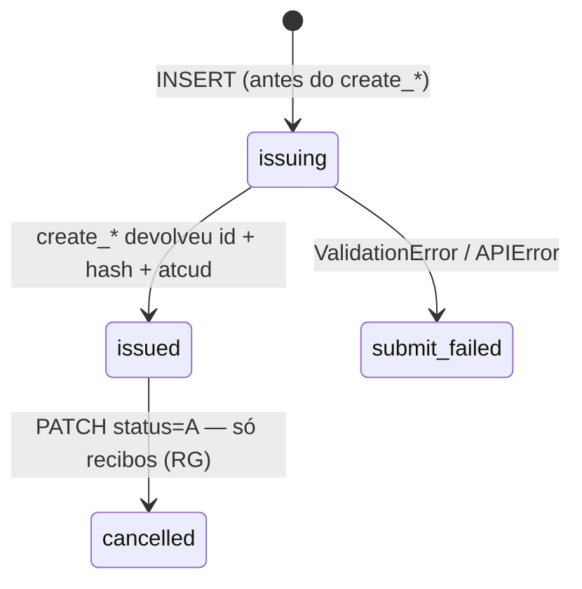

# Persistir documentos

Como guardar os documentos fiscais que emites pela Vendus, para que nada se perca
quando um processo crasha a meio da emissão, um retry dispara, ou precisas de
**reimprimir uma fatura legal anos depois**.

Um documento Vendus em modo real é um **registo fiscal permanente, comunicado à AT**:
não o podes editar, e uma fatura (FT), fatura-recibo (FR) ou nota de crédito (NC) nem
sequer pode ser cancelada — corriges emitindo uma *nova* nota de crédito. Por isso a
persistência aqui trata de duas coisas: nunca perder a referência a um documento fiscal
real que criaste, e guardar os dados de conformidade da AT (`number`, `hash`, `atcud`,
`qrcode`) para o poderes reimprimir e provar.

Esta receita dá-te um **schema de referência** (PostgreSQL, com justificação de
tipos/tamanhos e notas para outros motores), o **ciclo de vida** e as **funções** que o
conduzem. É agnóstica de framework — combina-a com a receita [FastAPI](fastapi.md),
[Django](django.md) ou [Flask](flask.md) para a camada HTTP.

## A regra única: escreve antes de emitir

Insere a linha — com a **tua** `external_reference`, `status='issuing'` — **antes** de
chamar `create_invoice()`, no mesmo processo, com commit:

```
INSERT (status='issuing', external_reference)  →  create_invoice(...)  →  UPDATE (status='issued', vendus_id, number, hash, atcud, qrcode, …)
```

Se o processo morre entre o POST ter sucesso na Vendus e tu guardares a resposta,
emitiste um **documento fiscal real — já comunicado à AT — de que o teu sistema não tem
registo**. Não é uma venda perdida; é um documento legal à solta. A linha write-ahead
torna esse órfão *encontrável*: um job de reconciliação pode listá-lo e decidir o que
fazer.

O write-ahead tem um segundo benefício, específico de faturação. A Vendus **não tem
chaves de idempotência** — a `external_reference` é a sua única âncora de deduplicação,
e o SDK só faz retry de um `POST` **quando a `external_reference` está definida** (regra
R3). Escrevê-la primeiro faz com que um retry reutilize a mesma âncora em vez de cunhar
uma FT duplicada.

## O ciclo de vida



`issuing` e `submit_failed` são estados **só-locais** — a Vendus nunca os vê.
`issued`/`cancelled` (mais `paid`/`partially_paid`, que a Vendus define para fluxos
pagos como uma FR) mapeiam para o enum `DocumentStatus` do SDK.

Duas coisas que *não* são transições desta linha:

- **Cancelamento.** Só um recibo (RG) pode ser cancelado (`PATCH status=A`). **FT, FR e
  NC não podem** — o SDK recusa-as. Reverte uma fatura emitindo uma nota de crédito, que
  é um documento **novo** (uma linha nova) cujo `corrects_document_id` aponta para aqui.
  O original fica `issued` para sempre.
- **Edição.** Depois de emitidos, `number`, `hash`, `atcud` e `qrcode` são dados AT
  imutáveis. Nunca lhes faças `UPDATE`.

## Schema (PostgreSQL)

Duas tabelas: o documento (estado atual + dados fiscais) e um log de eventos
append-only.

```sql
CREATE TABLE vendus_documents (
    id                   BIGINT GENERATED ALWAYS AS IDENTITY PRIMARY KEY,  -- a tua PK

    -- A TUA chave de correlação. Geras tu e passa-la ao create_*() como
    -- external_reference. É a única âncora de dedup da Vendus (não há chaves de
    -- idempotência) e o SDK só faz retry de um POST quando está definida (R3).
    -- Faz sempre o match por aqui.
    external_reference   TEXT NOT NULL UNIQUE,

    -- O id do documento na Vendus — o handle para get()/create_credit_note().
    -- NULL até a chamada de criação devolver. Inteiro no wire; BIGINT é
    -- à prova de futuro e gratuito.
    vendus_id            BIGINT UNIQUE,

    -- O número legal do documento, ex. 'FT 2026/123'. É ESTA a chave de
    -- reimpressão e o que sai impresso. Real vs teste distinguem-se pelo prefixo
    -- da série: 'FT 01P2026/…' (real) vs 'FT T01P2026/…' (teste). Guarda literal.
    number               TEXT,

    -- Código de tipo da Vendus (FT/FS/FR/RG/NC/…). Códigos desconhecidos
    -- normalizam para 'UNKNOWN' no SDK; o código real fica sempre em
    -- raw_response['type']. 2 chars hoje, mas dimensiona para o sentinela
    -- 'UNKNOWN'.
    type                 VARCHAR(16) NOT NULL,
    subtype              VARCHAR(16),

    -- 'normal' | 'tests'. Defines TU no momento da emissão; a Vendus não o
    -- devolve como campo tipado, por isso GUARDA-O. É determinante: um documento
    -- de teste é não-fiscal E não é recuperável via get()/create_credit_note()
    -- (vive num espaço separado). Nunca confies no vendus_id de uma linha teste.
    mode                 VARCHAR(8) NOT NULL,

    -- Dinheiro é NUMERIC, nunca float (R2). Bruto inclui IVA, líquido exclui.
    -- O SDK nunca popula tax_amount (R1 lista-o como derivado), por isso calcula
    -- imposto = bruto - líquido tu. A Vendus calcula o bruto/líquido
    -- autoritativos, logo isto é NULL até emitido.
    gross_amount         NUMERIC(13,2),
    net_amount           NUMERIC(13,2),
    tax_amount           NUMERIC(13,2),

    -- Dados de conformidade da AT — a razão de guardares registos fiscais.
    -- Guarda-os todos para poderes reimprimir o documento legal e o seu QR
    -- code offline. Podem ser strings AT longas → TEXT evita truncar.
    hash                 TEXT,   -- hash do documento AT
    atcud                TEXT,   -- ATCUD, ex. 'AAAAAAAA-123'
    qrcode               TEXT,   -- payload completo do QR code AT
    -- id gerado pela AT. Vazio para documentos de teste E vazio no momento da
    -- criação mesmo para reais (até a Vendus os comunicar). NÃO o uses para
    -- decidir real vs teste — o prefixo da série / a tua coluna `mode` é o sinal.
    tax_authority_id     TEXT,

    -- Ciclo de vida normalizado (CHECK, não ENUM nativo — adicionar um valor
    -- depois é um ALTER, não uma migração de tipo). 'issuing'/'submit_failed'
    -- são só-locais.
    status               VARCHAR(16) NOT NULL DEFAULT 'issuing'
        CHECK (status IN ('issuing', 'submit_failed', 'draft', 'issued',
                          'cancelled', 'paid', 'partially_paid')),

    -- Para uma nota de crédito (NC): a linha do original que credita. Self-FK;
    -- NULL para tudo o resto.
    corrects_document_id BIGINT REFERENCES vendus_documents (id),

    -- Liga a uma pessoa via a TUA tabela de utilizadores — NÃO copies o NIF /
    -- email / telefone do cliente para aqui. Esses são precisamente os campos
    -- que o SDK redige dos logs (R6). O cliente é fornecido por ti na emissão; a
    -- resposta de criação não o devolve. Ver "Segurança, PII e retenção".
    customer_id          BIGINT,   -- FK para a tua própria tabela de clientes

    -- A Vendus devolve date / local_time / system_time; guarda também o teu
    -- issued_at (quando a tua app fez commit do estado issued).
    doc_date             DATE,          -- 'date' da Vendus
    system_time          TIMESTAMPTZ,   -- 'system_time' da Vendus
    initiated_at         TIMESTAMPTZ NOT NULL DEFAULT now(),
    issued_at            TIMESTAMPTZ,
    updated_at           TIMESTAMPTZ NOT NULL DEFAULT now()
);

CREATE INDEX vendus_documents_status_idx    ON vendus_documents (status);
CREATE INDEX vendus_documents_vendus_id_idx ON vendus_documents (vendus_id);
CREATE INDEX vendus_documents_number_idx    ON vendus_documents (number);
```

O que deliberadamente **não** está aqui: nenhum NIF / email / telefone do cliente (PII →
FK `customer_id`), e nenhuma linha de item. A Vendus é o sistema de registo de um
documento emitido, e o seu detalhe completo está em
`raw_response`; mantém isso no log de eventos abaixo. Se tiveres mesmo de *consultar* por
linha, adiciona uma tabela-filha que espelha o `DocumentItem` (`description`, `quantity`,
`unit_price`, `tax_category`, `tax_exemption`, `discount`).

```sql
CREATE TABLE vendus_document_events (
    id           BIGINT GENERATED ALWAYS AS IDENTITY PRIMARY KEY,
    document_id  BIGINT NOT NULL REFERENCES vendus_documents (id),

    type         VARCHAR(24) NOT NULL
        CHECK (type IN ('initiated', 'create_requested', 'create_ok',
                        'create_failed', 'cancelled', 'credited', 'reconciled')),
    source       VARCHAR(16) NOT NULL
        CHECK (source IN ('api', 'reconciliation', 'backoffice', 'local')),

    -- A resposta / erro cru da Vendus. raw_response é o escape hatch do SDK
    -- (R9), a tua reimpressão de último recurso e o teu trilho de auditoria —
    -- mas payloads crus podem conter PII (um GET devolve o bloco do cliente),
    -- por isso guarda REDIGIDO.
    raw          JSONB,
    error_code   VARCHAR(16),   -- código de erro da Vendus em falha (ex. 'P001')

    -- RGPD: um job de purga pode anular `raw` após esta data. O registo fiscal
    -- em vendus_documents (number/hash/atcud) é um registo legal guardado por
    -- anos; os payloads crus com PII não têm de ser.
    purge_after  TIMESTAMPTZ,
    created_at   TIMESTAMPTZ NOT NULL DEFAULT now()
);

CREATE INDEX vendus_document_events_doc_idx ON vendus_document_events (document_id);
```

### Tranca o histórico

`vendus_document_events` é append-only. Impõe-o com grants, não com disciplina:

```sql
GRANT SELECT, INSERT ON vendus_document_events TO app_role;   -- sem UPDATE, sem DELETE
GRANT SELECT, INSERT, UPDATE ON vendus_documents TO app_role; -- sem DELETE:
-- um documento cancelado é um estado, não uma linha em falta, e um registo
-- fiscal nunca se apaga.
```

(A purga de retenção corre sob um role de manutenção separado que pode
`UPDATE vendus_document_events SET raw = NULL` após `purge_after`.)

## Referência de colunas

Cada coluna que vem do SDK, e o seu tipo. Os campos de `Document` são o que
`create_*()` / `get()` devolvem; os campos *input* são os que passaste (a Vendus não os
devolve como campos tipados).

| Coluna | Origem | Tipo SDK / Python | Tipo SQL | Notas |
|---|---|---|---|---|
| `external_reference` | *input* | `str` | `TEXT` UNIQUE | geras tu; a âncora de dedup (R3) |
| `vendus_id` | `Document.id` | `int` | `BIGINT` | handle para `get()` / notas de crédito |
| `number` | `Document.number` | `str` | `TEXT` | chave de reimpressão legal, ex. `FT 2026/123` |
| `type` | `Document.type` | `DocumentType` | `VARCHAR(16)` | código de 2 chars ou `UNKNOWN` |
| `subtype` | `Document.subtype` | `str \| None` | `VARCHAR(16)` | |
| `mode` | *input* | `DocumentMode` | `VARCHAR(8)` | `normal` / `tests` — guarda-o |
| `gross_amount` | `Document.gross_amount` | `Decimal` | `NUMERIC(13,2)` | c/ IVA; **nunca float** (R2) |
| `net_amount` | `Document.net_amount` | `Decimal` | `NUMERIC(13,2)` | s/ IVA |
| `tax_amount` | *derivado* | `Decimal` | `NUMERIC(13,2)` | o SDK nunca o devolve — calcula `bruto - líquido` |
| `hash` | `Document.hash` | `str \| None` | `TEXT` | hash AT |
| `atcud` | `Document.atcud` | `str \| None` | `TEXT` | ATCUD |
| `qrcode` | `Document.qrcode` | `str \| None` | `TEXT` | payload QR completo (longo) |
| `tax_authority_id` | `Document.tax_authority_id` | `str \| None` | `TEXT` | vazio até comunicado à AT |
| `status` | `Document.status` | `DocumentStatus` | `VARCHAR(16)` | enum normalizado |
| `doc_date` | `Document.date` | `datetime \| None` | `DATE` | usa `TIMESTAMPTZ` se precisares da hora |
| `system_time` | `Document.system_time` | `datetime \| None` | `TIMESTAMPTZ` | |
| *(raw)* | `Document.raw_response` | `dict` | `JSONB` | no log de eventos, redigido (R9) |

**Justificação dos tamanhos.** `NUMERIC(13,2)` chega até `99 999 999 999,99`. `type` tem
2 chars hoje, mas o sentinela `UNKNOWN` tem 7 → `VARCHAR(16)`. `mode` tem ≤6 (`normal`) →
`VARCHAR(8)`. `number`, `hash`, `atcud` e `qrcode` são strings AT abertas — no PostgreSQL
`TEXT` e `VARCHAR` são o mesmo tipo sem limite de comprimento, por isso `TEXT` evita
truncagem arbitrária; no MySQL / SQL Server usa `VARCHAR(64)` para `number`/`atcud` e
`TEXT` para `hash`/`qrcode`.

## As funções

Mostradas com placeholders SQL (`%s`) — adapta ao teu driver/ORM.

### 1. `begin_document()` — write-ahead

```python
import uuid

def begin_document(db, *, doc_type: str, mode: str, customer_id=None) -> str:
    # Não-adivinhável de propósito: a external_reference pode viajar em logs/URLs
    # e um sufixo aleatório evita colisões entre retries. É também a âncora de dedup.
    external_reference = f"DOC-{uuid.uuid4().hex[:16]}"

    db.execute(
        """INSERT INTO vendus_documents (external_reference, type, mode, customer_id)
           VALUES (%s, %s, %s, %s)""",
        (external_reference, doc_type, mode, customer_id),
    )
    db.execute(
        """INSERT INTO vendus_document_events (document_id, type, source)
           SELECT id, 'initiated', 'local' FROM vendus_documents
           WHERE external_reference = %s""",
        (external_reference,),
    )
    db.commit()          # ← commit ANTES de a Vendus saber
    return external_reference
```

### 2. `issue_invoice()` — regista o que a Vendus devolveu

```python
from vendus import APIError, DocumentItem, DocumentMode, ValidationError, VendusClient

def issue_invoice(db, client: VendusClient, *, register_id, items, customer_id=None,
                  mode="normal") -> "Document":
    ext = begin_document(db, doc_type="FT", mode=mode, customer_id=customer_id)
    try:
        doc = client.documents.create_invoice(
            register_id=register_id,
            items=items,
            external_reference=ext,          # ← a chave write-ahead = a âncora de dedup
            mode=DocumentMode(mode),          # ← nunca confies no default da caixa (R16)
        )
    except (ValidationError, APIError) as exc:
        db.execute(
            """UPDATE vendus_documents SET status = 'submit_failed', updated_at = now()
               WHERE external_reference = %s""",
            (ext,),
        )
        _add_event(db, ext, "create_failed", "api",
                   raw={"error": str(exc)}, error_code=getattr(exc, "error_code", None))
        db.commit()
        raise

    db.execute(
        """UPDATE vendus_documents SET
               status = 'issued', vendus_id = %s, number = %s, type = %s, subtype = %s,
               gross_amount = %s, net_amount = %s, tax_amount = %s,
               hash = %s, atcud = %s, qrcode = %s, tax_authority_id = %s,
               doc_date = %s, system_time = %s, issued_at = now(), updated_at = now()
           WHERE external_reference = %s""",
        (doc.id, doc.number, doc.type.value, doc.subtype,
         doc.gross_amount, doc.net_amount, doc.gross_amount - doc.net_amount,
         doc.hash, doc.atcud, doc.qrcode, doc.tax_authority_id,
         doc.date, doc.system_time, ext),
    )
    _add_event(db, ext, "create_ok", "api", raw=redact_pii(doc.raw_response))
    db.commit()
    return doc
```

### 3. `credit_document()` — o "reembolso" da faturação

Uma FT/FR/NC não pode ser cancelada; reverte-la com uma **nota de crédito**, que é um
documento novo a referenciar o original (R13). O original tem de ser um documento
**real, recuperável** — um documento em modo teste não pode ser creditado.

```python
def credit_document(db, client, *, original_external_reference: str, reason: str):
    row = db.fetch_one(
        "SELECT id, vendus_id, mode FROM vendus_documents WHERE external_reference = %s",
        (original_external_reference,),
    )
    if row.mode != "normal":
        raise ValueError("documentos em modo teste não podem ser creditados (não recuperáveis)")

    nc_ext = begin_document(db, doc_type="NC", mode="normal")
    nc = client.documents.create_credit_note(
        reference_document_id=row.vendus_id,   # o id Vendus do original REAL
        reason=reason,
        external_reference=nc_ext,
        mode=DocumentMode.NORMAL,
    )
    db.execute(
        """UPDATE vendus_documents SET
               status = 'issued', vendus_id = %s, number = %s, type = 'NC',
               gross_amount = %s, net_amount = %s, tax_amount = %s,
               hash = %s, atcud = %s, qrcode = %s, tax_authority_id = %s,
               corrects_document_id = %s, issued_at = now(), updated_at = now()
           WHERE external_reference = %s""",
        (nc.id, nc.number, nc.gross_amount, nc.net_amount, nc.gross_amount - nc.net_amount,
         nc.hash, nc.atcud, nc.qrcode, nc.tax_authority_id, row.id, nc_ext),
    )
    _add_event(db, nc_ext, "credited", "api", raw=redact_pii(nc.raw_response))
    db.commit()
    return nc
```

### 4. `reconcile()` — a rede de segurança

```python
def reconcile(db, client) -> None:
    # (a) Órfãos: 'issuing' há mais de uns minutos. O crash aconteceu entre o
    #     INSERT e a resposta. Numa linha em modo REAL o documento pode já
    #     existir na Vendus. Não há chave de idempotência, por isso NÃO
    #     reemitas às cegas (arriscas uma FT duplicada). Duas rotas seguras:
    #       - listar documentos recentes e fazer match da tua external_reference
    #         com o que a Vendus devolve (verifica raw_response) e anexar; ou
    #       - marcar a linha para um humano reconciliar contra o backoffice Vendus.
    for row in db.fetch_all(
        """SELECT id, external_reference FROM vendus_documents
           WHERE status = 'issuing'
             AND initiated_at < now() - interval '15 minutes'"""
    ):
        ...  # anexa se encontrado, senão marca para revisão; event(type='reconciled')

    # (b) Purga payloads crus após retenção. O estado fiscal fica; o PII sai.
    db.execute(
        "UPDATE vendus_document_events SET raw = NULL WHERE purge_after < now()"
    )
    db.commit()
```

Corre-a por cron / Celery beat. É intencionalmente aborrecida — reconciliação aborrecida
é a que funciona às 3 da manhã.

## Checklist de quirks

Factos verificados ao vivo (regra R16) e o que o schema faz com cada um:

| # | Quirk | O que o schema faz |
|---|---|---|
| 1 | Sem chaves de idempotência; `external_reference` é a única âncora de dedup, e o SDK só faz retry de um POST quando está definida (R3) | `external_reference NOT NULL UNIQUE`, escrita antes da chamada |
| 2 | `mode` herda o modo da caixa → um `mode` omitido pode emitir silenciosamente um documento de **teste** | coluna `mode` `NOT NULL`, definida explicitamente, guardada |
| 3 | Documentos em modo teste vivem num espaço separado — não recuperáveis/creditáveis via `get()`/`create_credit_note()` | `mode` guarda o crédito; nunca confies no `vendus_id` de uma linha `mode='tests'` |
| 4 | `tax_authority_id` está vazio no momento da criação mesmo para docs fiscais reais (o prefixo de série `T` é o verdadeiro sinal) | decide real vs teste por `number` / `mode`, não por `tax_authority_id` |
| 5 | FT/FR/NC não podem ser canceladas — reverte com uma nota de crédito (documento novo) | self-FK `corrects_document_id`; `cancelled` só alcançável para RG |
| 6 | Uma nota de crédito tem de referenciar um original **real** | credita só linhas `mode='normal'`; guarda o `vendus_id` |
| 7 | Códigos de tipo desconhecidos normalizam para `UNKNOWN`; o código real fica em `raw_response['type']` | `type VARCHAR(16)`; guarda o `raw_response` no log de eventos |
| 8 | A resposta de **criação** não devolve um objeto cliente (a Vendus faz upsert por NIF) — fornece-lo tu | os dados do cliente são teus; liga via `customer_id`, não copies PII para a linha |
| 9 | `number` é a chave de reimpressão legal; real vs teste distinguem-se pelo prefixo da série | guarda o `number` literal; indexa-o |

## Segurança, PII e retenção

- **Nunca apagues uma linha fiscal.** A lei portuguesa exige a retenção dos registos de
  faturação (e do SAF-T que deles deriva) por vários anos — comummente citados como
  **10**; confirma o requisito atual com o teu contabilista. Para o schema a regra é
  simples: `number`/`hash`/`atcud`/`qrcode` *são* o registo — guarda-os.
- **Não copies PII do cliente para a linha do documento.** `fiscal_id` (NIF), `email`,
  `phone`, `mobile`, `address`, `postalcode` são exatamente os campos que o SDK redige
  dos logs (R6). Liga via `customer_id` à tua própria tabela de utilizadores e mantém
  uma cópia autoritativa sob os teus controlos de proteção de dados.
- **Payloads crus podem conter PII do cliente.** Um GET devolve o bloco do cliente, por
  isso guarda o `raw` **redigido** no log de eventos append-only e expira-o via
  `purge_after`. O estado financeiro/fiscal vive para sempre; os payloads crus com PII
  não têm de viver.
- **O histórico é append-only por grant**, não por convenção (ver os grants acima).
- **A `external_reference` é não-enumerável** (baseada em UUID) — pode aparecer em
  logs/URLs. Ids sequenciais expõem o teu volume de emissão e convidam à enumeração.

## Outras bases de dados

- **SQLite / MySQL**: dinheiro → `DECIMAL(13,2)`; `JSONB` → `JSON` (MySQL) ou `TEXT`
  (SQLite); usa os tamanhos `VARCHAR` acima; `TIMESTAMPTZ` → `DATETIME` / `TEXT`. Impõe o
  append-only na app (o SQLite não tem grants por tabela).
- **DynamoDB (single-table)**: `PK = DOC#{external_reference}`, `SK = META` para o
  documento e `SK = EVENT#{iso_ts}` para o log; um GSI em `vendus_id` e outro em `status`
  (para o `reconcile()`); o atributo nativo `ttl` = `purge_after`; dinheiro como strings
  (`"49.90"`) ou cêntimos inteiros; append-only via IAM (permite `PutItem` nos itens
  `EVENT#`, sem `UpdateItem`).

## Checklist antes de ir para produção

- [ ] `begin_document()` faz commit **antes** da chamada `create_*()`
- [ ] a linha é chaveada por `external_reference` (`NOT NULL UNIQUE`) e passas esse mesmo
      valor ao `create_*()`
- [ ] o `mode` é guardado explicitamente — nunca dependas do default da caixa
- [ ] as colunas de dinheiro são `NUMERIC`/`DECIMAL`, nunca `float`
- [ ] `number`/`hash`/`atcud`/`qrcode` guardados para cada documento real
- [ ] notas de crédito só contra linhas `mode='normal'`; `corrects_document_id` definido
- [ ] payloads crus redigidos à entrada do log de eventos; `purge_after` definido
- [ ] grants: o role da app não pode `UPDATE`/`DELETE` o log de eventos, nem `DELETE`
      documentos
- [ ] linhas fiscais retidas conforme o teu período de retenção legal

---

Relacionado: [Configuração](../getting-started/configuration.md) ·
[Fatura (FT)](../documents/invoice.md) ·
[Nota de Crédito (NC)](../documents/credit-note.md) ·
[Erros e Troubleshooting](../errors/index.md) ·
[Referência API](../api/index.md)
